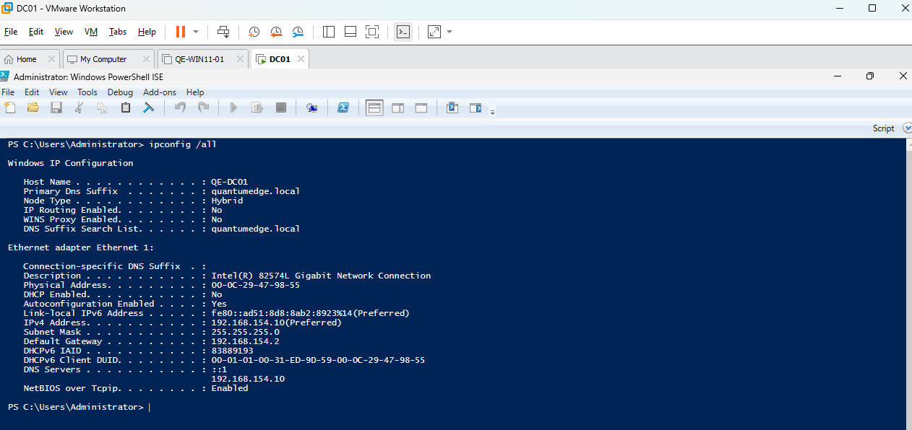
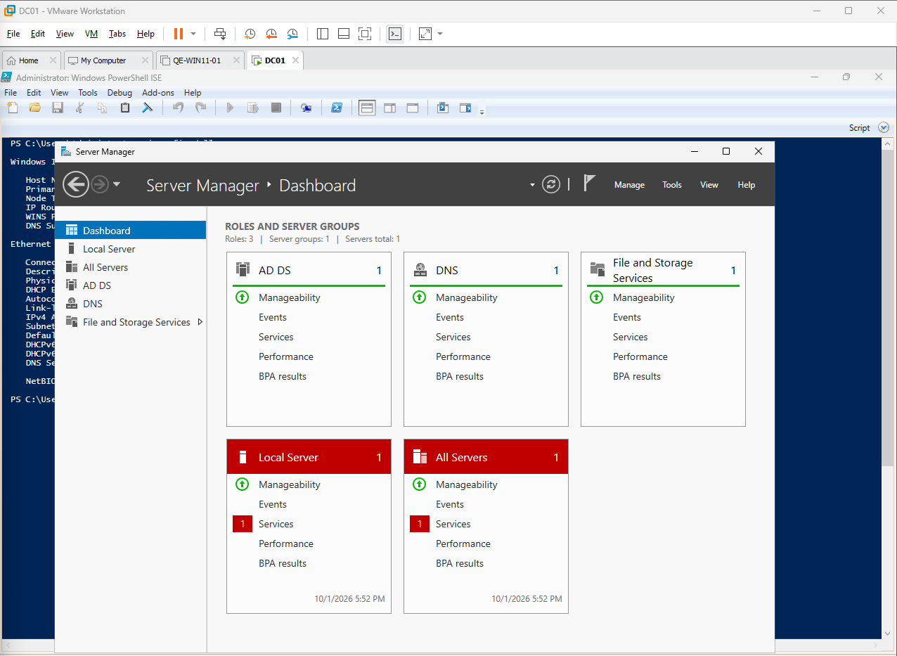
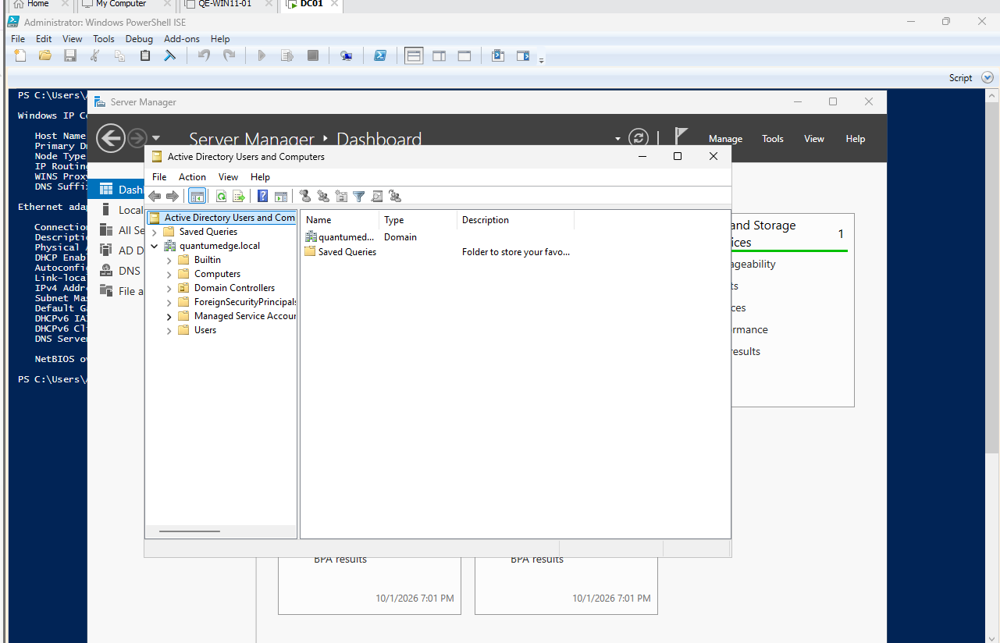
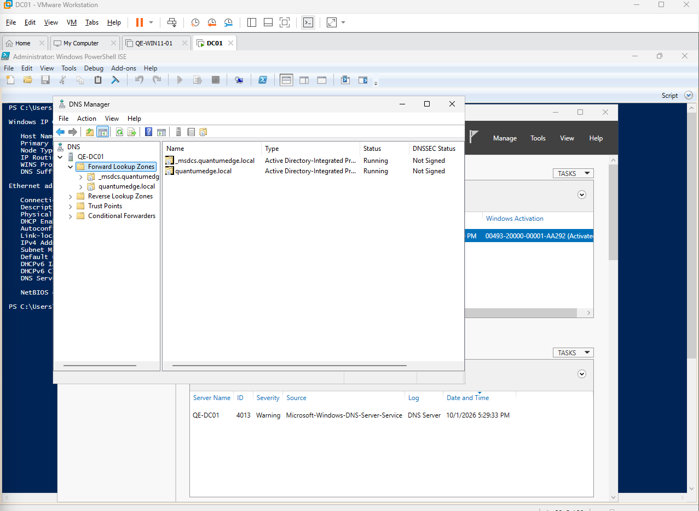
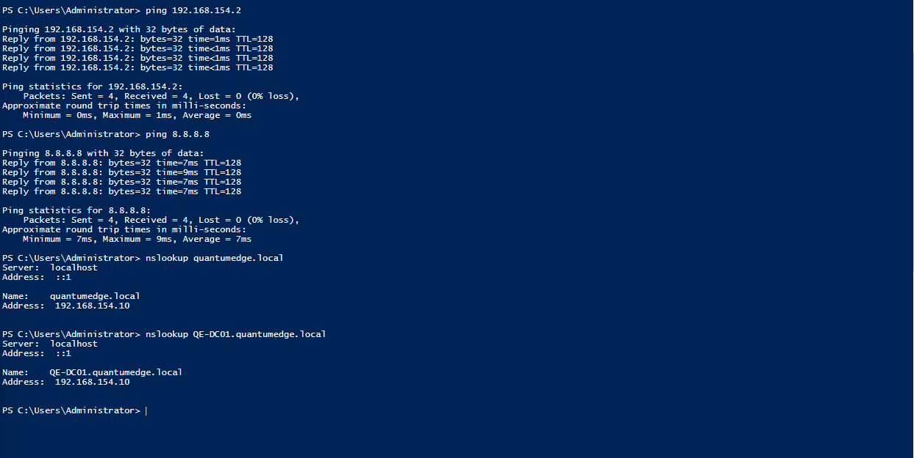

# Domain Controller Deployment

## Objective

Deploy a Windows Server virtual machine as the Domain Controller for the homelab and configure centralized authentication and DNS services.

## System Information

- Hostname: `QE-DC01`
- Operating System: Windows Server
- IPv4 Address: `192.168.154.10`
- Subnet Mask: `255.255.255.0`
- Default Gateway: `192.168.154.2`
- DNS Server: `192.168.154.10`

## Installed Roles

- Active Directory Domain Services (AD DS)
- DNS Server

## Active Directory Configuration

- Forest: `quantumedge.local`
- Domain: `quantumedge.local`

## Configuration Summary

The server was configured with a static IP address before being promoted to a Domain Controller.

Active Directory Domain Services and DNS Server were installed through Server Manager.

The server was then promoted as the first Domain Controller in a new Active Directory forest.

## Validation

The following tests were performed:

- Confirmed connectivity to the VMware NAT gateway
- Confirmed internet connectivity
- Confirmed DNS resolution
- Confirmed Active Directory Domain Services was running
- Confirmed the DNS Server role was functioning
- Confirmed the `quantumedge.local` domain was created successfully

## Screenshots

### Server Identity and Network Configuration

### Installed Server Roles

### Active Directory Domain

### DNS Configuration

### Connectivity Validation

## Troubleshooting

During initial network configuration, the VMware NAT gateway became unreachable. Attempted to switch DHCP

back to auto but this did not resolve the issue.

The issue was resolved by restarting the VMware NAT and DHCP services (using 'services.msc') on the host machine.

## Lessons Learned

- Domain Controllers should use static IP addresses.
- Active Directory relies heavily on DNS.
- Domain clients should use the Domain Controller as their DNS server.
- VMware NAT can provide internet access while keeping the lab on a private virtual network.
- When logging in the `.\` tells windows to authenticate via the local machine not the domain (QE).
- `QE-WIN11-01\user` = local machine\user= Local Account.
- `QuantumEdge\user` = Domain\user= Domain Account.
- The section before the `\` is where we authenticate from.
